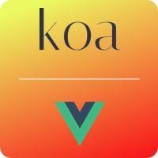

<p align="center"><a href="https://koa-vue-notes-web.innermonkdesign.com/" target="_blank"></a></p>

<p align="center">
  <a href="http://opensource.org/licenses/MIT"></a>
  <a href="https://twitter.com/intent/tweet?url=https%3A%2F%2Fgithub.com%2Fjohndatserakis%2Fkoa-vue-notes-api&text=Check%20out%20koa-vue-notes-api%20on%20GitHub&via=innermonkdesign">
  </a>
</p>

# Koa-Vue-Notes-Api

This is a simple SPA built using [Koa](http://koajs.com/) (2.3) as the backend and [Vue](https://vuejs.org/) (2.4) as the frontend. Click [here](https://github.com/johndatserakis/koa-vue-notes-web) to see the frontend Vue code. Click [here](https://koa-vue-notes-web.innermonkdesign.com/) to view the app live.

## Features
- Koa 2.3
- Fully written using async/await
- Koa-Router
- Koa-Ratelimit
- Koa-Bodyparser
- KCors
- Koa-Json-Error
- Koa-Useragent
- Bcrypt
- Sendgrind Mailer
- Joi
- Fs-Extra
- JWT
- Nodemon
- Prettier
- Babel
- PM2
- MySQL
- log4js
- And more...

## Installing / Getting started

``` bash
# install dependencies
npm install

# serve using nodemon with hot reload
npm run watch

# build for production with prettier
npm run build

# serve in production using the pm2 ecosystem.json file
npm run start-production
```

## General Information

This backend is part of a pair of projects that serve a simple notes app. I chose a notes app because it gives you a good look at the different techniques used in both the frontend and backend world. What's really cool is these projects feature a fully fleshed-out user login/signup/forgot/reset authentication system using JWT.

I've liberally commented the code and tried to balance the project in a way that it's complex enough to learn from but not so complex that it's impossible to follow. It can be tough to learn from a boilerplate that has too much or too little.

Having used mainly PHP for the backend in the past - I am very glad I checked out Koa as I think it is absolutely awesome in the way it handles the server code. Same thing with Vue - I've used mainly jQuery in the past - albeit with the really structured Revealing-Module-Pattern - and using Vue was such a pleasure. You can really tell right away what kind of power a well-structured library can give you.

You'll need to create a `.env` file and place it in the root of your directory. Take a look at `example.env` and add your information as needed. For `JWT_ACCESS_TOKEN_EXPIRATION_TIME` you can set it to 5m, 5w, 5d etc.

This project only responds and listens in json. Keep that in mind when send requests through Postman or your frontend.

### User Authentication Process

As mentioned in the frontend code, the user authentication process is this:

- User create an account
- User logs in
- The server sends and `accessToken` and a `refreshToken` back
- We take the `accessToken` and decoded it using `jwt-decode`. This gets us the logged in user's information. We stick this in the Vuex variable `user`. Then we store the `refreshToken`.
- Each protected endpoint will be expecting you to attach the `accessToken` you have to the call (using Authentication: Bearer). After a short amount of time, the server will respond with `401 TOKEN EXPIRED`. When you see this - that means you need to send your `refreshToken` and `user.email` to the endpoint that deals with `accessToken` refreshing. Once you do that, you'll received a brand new `accessToken` and `refreshToken`.
- Repeat the process as needed.

### PM2

This project features an `ecosystem.json` file that is the target of the PM2 implementation in production. Very simple - we just give it a name and some other basic info and PM2 handles the rest. Great library with awesome documentation.

The `src` folder is the heart of the program. I'll go over its subfolders now.

### controllers

We use controllers to keep our router thin. The controller's responsibility is to manage the request body and make sure it's nice and clean when it eventually gets sent to a `model` to make database calls. There are two controller files present - one for user signup/login/forgot... and one for notes.

### db

Here is our database setup. Basically we create a pool variable and export it to be used throughout our app. Very simple. A note - we are using the `promise-mysql` library instead of the vanilla `node-mysql` library to take advantage of it promise features. This works really well as we're able to fully utilize the new async/await present in the latest versions of Node. It makes the code really nice and lean.

### middleware

Here I place any custom middleware the app is using. The custom middleware we're using is based on the `koa-jwt` library - but I had to tweak it because it mysteriously didn't report an expired token correctly. Strange as I though that would be an important requirement. No biggie.

### models

Our models folder contains two model files - one for users and one for notes. These models are where the actual database calls are made. This keeps things nice and neat - also make actions reusable for the future.

### routes

Very simple - here are our routes. I've broken it down into two files - this keeps things in control. Each route is nice and thin - all it's doing is calling a controller. Some routes are using that jwt middleware I mentioned earlier. Koa make it really nice and easy to add middleware to a route. Very cool.

### sql

I provided the sql code here you'll need when creating your database. I was hoping to find a nice database-migration library for node - but unfortunately I came up empty-handed. I tried TJ's - but I think it's not really supported anymore - didn't work for me using the latest Node and ES6/7 syntax. I'm keeping my eye out for one - let me know if you use one you like.

### static

Static files - just used for the favicon.

### index.js

index.js isn't a folder - it's the brain of the app. Here you'll see we are attaching a bunch of middleware to our Koa instance. Very slick and straight-forward.

## Hit Me Up

Go ahead and fork the project! Message me here if you have questions or submit an issue if needed. I'll be making touch-ups as time goes on. Have fun with this!

## License

Copywrite 2017 John Datserakis

[MIT](http://opensource.org/licenses/MIT)
